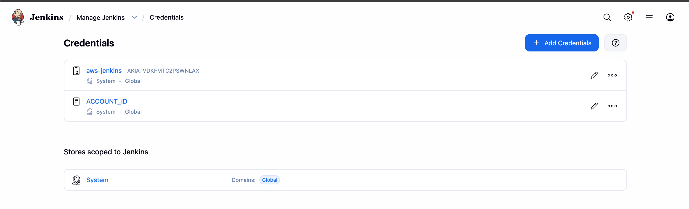

# StreamingApp — Deployment Process

> Region: **us-east-1** (S3 media bucket in **us-west-2**) · CI: **Jenkins (local, native) + ngrok webhook** · Orchestration: **Amazon EKS + Helm**

## Phase 1 — Version control

Forked `UnpredictablePrashant/StreamingApp`, added the original as `upstream` for syncing:

```bash
git clone https://github.com/Avinashsain/StreamingApp-Assignment-HV.git
git remote add upstream https://github.com/UnpredictablePrashant/StreamingApp.git
# sync when needed:
git fetch upstream && git merge upstream/main && git push origin main
```


## Phase 2 — Containerization

The app ships Dockerfiles for all five components. Build contexts differ per service (streaming/admin/chat share `backend/` as context; auth uses `backend/authService`). Verified locally with `docker-compose up --build` — frontend on :3000, services on :3001–:3004, MongoDB on :27017.


## Phase 3 — AWS environment

```bash
aws configure          # IAM user keys, region us-east-1
aws sts get-caller-identity
./scripts/create-ecr-repos.sh          # 5 repos: streamingapp/{frontend,auth,streaming,admin,chat}
```

Media storage uses the pre-existing S3 bucket `streamingappbucketb15` in **us-west-2**; the app's `AWS_REGION` env var points at the bucket region while all other infrastructure runs in us-east-1.


## Phase 4 — CI with Jenkins

Jenkins runs **natively on the local machine** (zero EC2 cost) with Docker Desktop, AWS CLI, kubectl and helm available on the host. AWS access uses a Jenkins credential (`aws-jenkins`, type AWS Credentials) consumed via `withCredentials` — no keys in source control, masked in build logs.

GitHub → Jenkins connectivity uses an ngrok static domain:

```bash
ngrok http 8080 --domain=<static-domain>.ngrok-free.dev
# GitHub webhook payload URL: https://<static-domain>.ngrok-free.dev/github-webhook/
```

Pipeline job: *Pipeline script from SCM* → this repo → `Jenkinsfile`, trigger: *GitHub hook trigger for GITScm polling*.

Pipeline stages: **Checkout** (sets IMAGE_TAG = 12-char git SHA) → **AWS Login** (ECR docker login) → **Build Backend Images** (loop over 4 services with correct contexts, `--platform linux/amd64`) → **Build Frontend Image** (production ELB URLs as build args) → **Deploy to EKS** (helm upgrade with S3 keys injected via `--set`) → **post**: SNS success/failure notification (wrapped in `withCredentials`).




## Phase 5 — EKS + Helm

```bash
eksctl create cluster --name streamingapp-eks --region us-east-1 \
  --nodegroup-name workers --node-type t3.medium --nodes 2 --nodes-min 2 --nodes-max 3 --managed
```

Kubernetes **1.34** with metrics-server as an EKS addon. Additionally required for this version: the **EBS CSI driver addon** (`eksctl create addon --name aws-ebs-csi-driver ...` plus `AmazonEBSCSIDriverPolicy` on the node role) and patching `gp2` as the **default StorageClass** — without both, the MongoDB PVC stays Pending forever.

The Helm chart (`helm/streamingapp/`) templates: 4 backend Deployments + Services rendered from a single loop over `values.yaml`, frontend Deployment + Service, MongoDB StatefulSet with a 5Gi gp2 PVC and TCP-socket health probes, Secret for JWT/AWS keys, and HPAs for all backends (deployments intentionally omit `replicas` so the HPA owns scaling).

**Two-run deployment (frontend URLs are build-time):**

- **Run 1:** push chart + Jenkinsfile → Jenkins builds everything (frontend with placeholder URLs) and deploys. Backends receive ELB DNS names.
- **Run 2:** `./scripts/get-service-urls.sh` prints the ELB URLs and ready-made `FE_*` values → paste into the Jenkinsfile, set `env.clientUrls` (CORS) in values.yaml to the frontend ELB → push → Jenkins rebuilds the frontend with real URLs and redeploys.


## Phase 6 — Monitoring & logging

Attached `CloudWatchAgentServerPolicy` to the nodegroup role, then installed the Container Insights quickstart (CloudWatch agent + Fluent Bit DaemonSets). Result:

- Metrics: CloudWatch → Container Insights → per-pod CPU/memory for the cluster.
- Logs: log group `/aws/containerinsights/streamingapp-eks/application` centralizes all pod logs.
- Alarm: `streamingapp-high-cpu` (pod CPU > 80% for 10 min) → SNS.


## Phase 7 — ChatOps (bonus)

SNS topic `streamingapp-alerts` with a confirmed email subscription. The Jenkins `post{}` block publishes on every success/failure, and the CloudWatch alarm targets the same topic. Full loop: **push → webhook → build → deploy → SNS → email**.


## Phase 8 — Validation performed

| Check | Result |
|---|---|
| All pods Running, HPAs active | ✅ |
| Register + login via frontend ELB (frontend↔auth↔Mongo) | ✅ |
| Admin role + video upload via admin + playback (S3 integration) | ✅ |
| Live chat across two browser tabs (websockets) | ✅ |
| Commit push → webhook → auto build → auto deploy | ✅ |
| Deleted a pod → recreated automatically (self-healing) | ✅ |
| SNS notification received on deploy | ✅ |


## Scaling behaviour

Each backend runs under an HPA (CPU 70%, max 4 replicas); the managed nodegroup scales 2→3 nodes. Scaling was observed live: during a MongoDB outage, crash-looping services burned CPU and the HPA scaled auth/streaming to 2 replicas, then scaled back down after stabilization.


## Teardown

```bash
./scripts/cleanup.sh
# 1. helm uninstall (removes ELBs + PVC)
# 2. eksctl delete cluster
# 3-5. optional: log groups, alarm + SNS topic, ECR repositories
# Ends with an executed verification (clusters, ELBs, volumes, instances, log groups all empty)
```


Verified no leftover load balancers or unattached EBS volumes after deletion.

## Troubleshooting encountered / notes

The full 11-issue journal (with root causes) is in the [README](../README.md#troubleshooting-journal-real-issues-i-solved). Highlights:

| Issue | Resolution |
|---|---|
| `ImagePullBackOff` — platform mismatch (Apple Silicon arm64 vs x86 nodes) | `docker build --platform linux/amd64` in Jenkinsfile and scripts |
| Mongo PVC Pending forever | EBS CSI addon + node-role policy + gp2 set as default StorageClass + PVC recreated |
| Helm StatefulSet "spec forbidden" on upgrade | `kubectl delete statefulset mongo --cascade=orphan`, helm recreates it |
| Helm vs HPA conflict over `.spec.replicas` | Removed `replicas` from deployment templates |
| Frontend API calls hit placeholder URLs | Run 2 rebuild with real ELB URLs (verified with `git show HEAD:Jenkinsfile`) |
| CORS errors in browser console | Set `env.clientUrls` in values.yaml to the frontend ELB URL |
| Thumbnails pointed at localhost:3002 | `STREAMING_PUBLIC_URL` env var added to Helm values |
| SNS publish `NoCredentials` in post-actions | Wrapped publishes in `withCredentials` inside `post{}` |
